## Dspace Importer
The application is used to batch add items to a collection in DSpace. The metadata for the items are entered into an Excel file.

### The Excel File
The file has one item per row. The first row has to contain the column headings. The column heading names can be repeated. The column heading names are mapped to metadata elements in DSpace. The Excel file has one column for the title of the item. This column is required. The application imports one sheet from the Excel file at a time.

### Starting the Application
The application is started from the command prompt. Within the command prompt, change directory to the directory containing the application files using the cd command. The application is started using the command `py DSpaceImport.py`.

### Using the Application

The import is done by a DSpace user. When the application opens, a logon prompt is shown (figure 1).  The user will need to have submission access to the collection the items are to be uploaded to.

<figure>
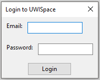
<figcaption><b>Figure 1</b>: Logon Screen</figcaption>
</figure>

The application then opens upon successful, the application will be displayed (figure 2).

<figure>
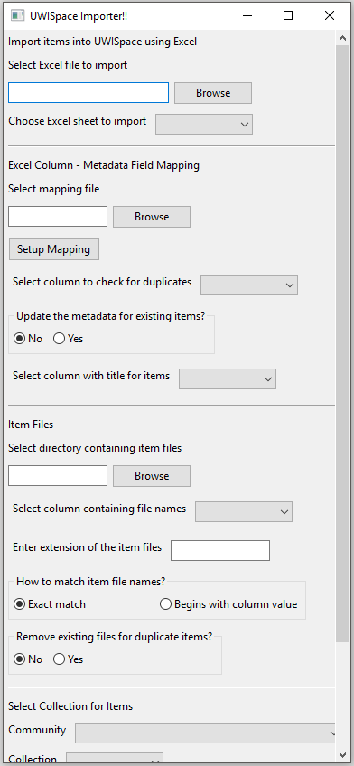
<figcaption><b>Figure 2</b>: Application Screen</figcaption>
</figure>

The Excel file is chosen using the "Select Excel file to import" file select field. Click on the "Browse" button to browse to the directory containing the file. The "Choose Excel sheet to import" dropdown list is redrawn with all the sheets in the file (figure 3). The sheet is then chosen from this list.

<figure>

<figcaption><b>Figure 3</b>: Select Excel sheet to import</figcaption>
</figure>

The mapping between the column heading names and the DSpace metadata elements is then setup. The mapping can be setup by clicking on the "Setup Mapping" button. A popup is shown with all the columns from the Excel file (figure 4).

<figure>
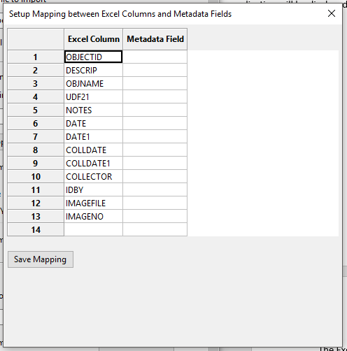
<figcaption><b>Figure 4</b>: Mapping Screen</figcaption>
</figure>

The metadata element is entered in the Metadata Field column. The metadata element is entered in the format `<namespace>.<element>.<qualifier>` for example, `dc.title` or `dc.contributor.author`. A metadata element does not have to be entered for all the Excel columns. Any column without a mapping will be skipped.

The mapping is set by clicking on the "Save Mapping" button. The application also prompt to save the mapping to a file. This is optional. Saving the mapping to a file (with a `.map` extension) means that the mapping can be reused or shared with another user. The mapping can be reused if an Excel file with the same column heading names is used to import another set of data. The application will use the mapping file to match the column heading names to the metadata elements. 

A previously saved mapping can be used by clicking on the "Select mapping file" file select (figure 5).

<figure>
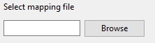
<figcaption><b>Figure 5</b>: Select mapping file</figcaption>
</figure>

The application can also, optionally, update the metadata of existing items in the collection or do not import the item from the Excel file if a duplicate is found. The Excel sheet will need to have a column that will be used to search for duplicates. This checking will be skipped if no columns are chosen. Figure 6 shows the controls to set this functionality.

<figure>
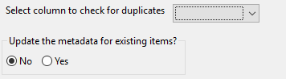
<figcaption><b>Figure 6</b></figcaption>
</figure>

The column in the Excel sheet that will be used to check for duplicates is chosen from the "Select column to check for duplicates" dropdown list. The "Update the metadata for existing items?" radio button is used to indicate if the duplicate items are updated or ignored.

The column containing the title for the items is then selected using the "Select column with title for items" dropdown (figure 7). This is mandatory.

<figure>
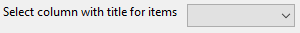
<figcaption><b>Figure 7</b>: Select title column</figcaption>
</figure>

Files can be uploaded with each item. The Excel file will have a column with the name of the file. If the column is blank for a particular item, the item will be imported with just the metadata. Figure 8 shows the file upload controls.

<figure>
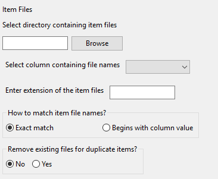
<figcaption><b>Figure 8</b>: File upload controls</figcaption>
</figure>

The directory where the files are stored is chosen using the "Select directory containing item files" directory select. The application can search subdirectories if the subdirectory is included in the column for the file name in the Excel file. For example, `dir1/file1.pdf` will cause the application to look in the `dir1` subdirectory for `file1.pdf`. If this is left blank, no files will be uploaded with the items.

The "Select column containing file names" dropdown is used to select the column from the Excel file with the file names. This is mandatory. The Excel file can have rows with the file name column blank. In this case, the item metadata alone will be imported.

The "Enter extension of the item files" textbox has the extension of the files. If the names are entered in Excel without the extension, the extension can be entered here and the application will search for the file name. The application does not support a mixture of file names with and without the extension. 

The "How to match item file names?" radio button indicates how the application will search for file names. If the "Exact match" option is chosen, the application will use the file name as it is entered in the Excel file. This will upload a single file per item. The "Begins with column value" option causes the application to search for files with names starting with what is given in the file name column in Excel. The "Enter extension of the item files" textbox is required in this case and is used to search for the files. This option can be used to upload more than one file for an item. For example, if the file name column in the Excel file has `item_` and the file extension is `.pdf`, the application will match files `item_1.pdf`, `item_2.pdf`, `item_three.pdf`, and upload them with the item.

The "Remove existing files for duplicate items?" radio button indicates how the application will treat with duplicates. If the "Select column to check for duplicates" dropdown is filled (figure 6) and "Remove existing files for duplicate items?" is set to "Yes", the existing files for the duplicate items are removed and the files specified for the item in the Excel file (if any) are uploaded. If the radio button value is set to "No", the files are not removed and the files specified in the Excel file (if any) are added to the item.

The collection to upload the items to is then selected (figure 9). The community is selected from the community dropdown. The collection dropdown will redraw to display the collections in the selected community. 

<figure>
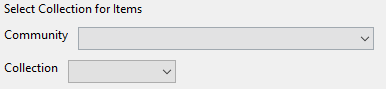
<figcaption><b>Figure 9</b>: Select Collection</figcaption>
</figure>

To go to the parent community, there is a "Back" option under the selected community (figure 10). This will display the communities previously displayed.

<figure>
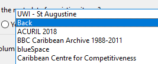
<figcaption><b>Figure 10</b></figcaption>
</figure>

The items are uploaded to the selected collection by clicking on the "Import" button (figure 11).

<figure>
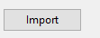
<figcaption><b>Figure 11</b>: Import button</figcaption>
</figure>

The application does a number of checks, depending on the options chosen and the data in the Excel file, when the “Import” button is clicked. If there are any errors, these will be shown in a dialog popup. An example is shown in figure 12.

<figure>
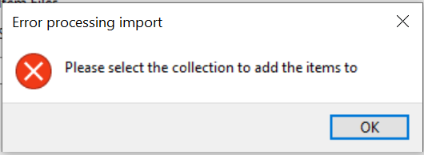
<figcaption><b>Figure 12</b>: Import Error Example</figcaption>
</figure>

The application will display a message "Imported items successfully" when all the items have been uploaded to the collection.
