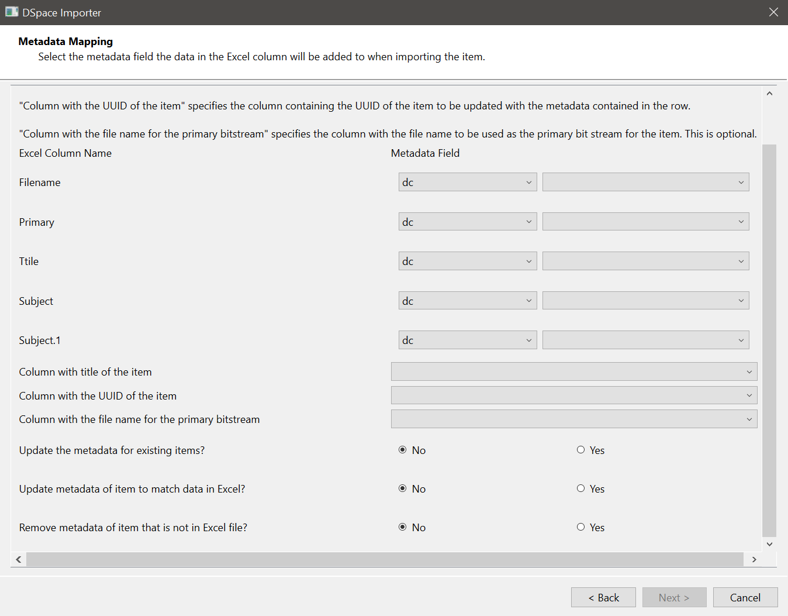

# User Manual

The application is used to batch add items to a collection in DSpace. The application can also update the metadata for existing items in a collection. The metadata for the items are read from an Excel file. The application uses DSpace's REST API and can be run from a client machine.

## The Excel File

The data can be uploaded from a single worksheet at a time. The worksheet has one item per row. The first row has the column headings. The column heading names can be repeated. The column heading names are mapped to metadata elements in DSpace. 

The Excel worksheet must have a column for the title of the item. This is required when items are being added or the metadata of existing items updated. 

If existing items are to be updated, the Excel worksheet has a column containing the UUID of the item to be updated.

### Files

Files can be optionally uploaded with the metadata for an item. The file name is entered in a column of the Excel worksheet. There are three ways to specify the file(s) to be added to the item:

1. The file name and extension of a single file. An optional description can be added after the file name. A `|` character is added between the file name and description.
2. If multiple files are to be added to the item and they are of different types, they entered in the Excel worksheet as follows:  
The file and the optional file description are entered as 1. above. A semicolon (`;`) is added between the files.  
Examples are: `file1.ext|file1 description;file2.ext;file3.ext|file3 description` or `file1.ext|file1 description;file2.ext`.
3. If multiple files are to be added to the item and they are of the same type, option 2. above can be used, or they can be entered in the Excel worksheet as follows:  
The files are named such there is a common part unique to the item the files are for. For example, the file names can be `item1_front.pdf`, `item1_back.pdf`. The common part entered in the Excel worksheet. File descriptions are not supported using this method.

The directory containing the files is entered in the application. If the files are in sub-directories of that directory, the sub-directory is prepended to the file name in the Excel worksheet with a `/` added between them. For example, if `dir1/file1.ext` is in the Excel worksheet, the application will look for a file names `file1.ext` in a sub-directory `dir1` under the directory entered in the application.

The primary bitstream can be identified in the Excel worksheet. This is optional. DSpace uses the thumbnail of the primary bitstream of the ORIGINAL bundle as the main thumbnail for the item.  
If the primary bitstream is needed, a column is added to the Excel worksheet for the primary bitstream. The file name (and extension) is added for the item. It can be identified for some items and left blank for others. The application will not set the primary bitstream flag for the items with blank values.

An example of an Excel worksheet to add items is:

| Filename | Primary | Title | Subject | Subject | 
| ---      | ---     | ---   | ---     | ---     | 
| file1.ext | file1.ext | Title One | Subject one | Subject two | 
| file2.ext &#124; Description | | Title Two | Subject three | Subject two | 
| file3.ext &#124; Description; file4.ext | file4.ext | Title Three | Subject five | Subject six | 
| file5.ext &#124; Description; file6.ext &#124; Description | file6.ext | Title Four | Subject four | Subject five | 

## Application Configuration

The configuration values are stored in the file `config.toml`. The configuration keys and values present in the file are:  

| Key | Description |
| --- | --- |
| `locale` | The language the UI components are displayed in. Currently `en` is supported. | 
| `wizardWidth` | The width of the GUI window. | 
| `wizardHeight` | The height of the GUI window. | 
| `dspaceRestURL` | The URL of the DSpace REST server. | 
| `metadataNotRemoveUpdate` | A comma delimited list of metadata fields not to be changed or removed when an item is updated by the application. The following are set `dc.identifier.uri, dc.description.provenance, dc.date.available, dc.date.accessioned` |
| `provenance.enabled` | A flag to indicate if to add provenance metadata when items are uploaded or updated. The key is set to `true` to enable. |
| `provenance.metadata-field` | The metadata field that would be used to store the provenance information |
| `provenance.add` | The value of the provenance metadata field when items are added. The following placeholders can be used: <ul><li>{u} - This is replaced by the email address of the user logged on to the application.</li><li>{t} - This is replaced by the current timestamp (UTC).</li></ul>  |

## Using the Application

The import is done by a DSpace user. The user will need at least submit access to the collection the items are uploaded to. The login form (figure 1) is displayed when the application is launched.

<figure>

<figcaption><b>Figure 1</b>: Logon Screen</figcaption>
</figure>

The `Next >` button is activated when a email address and password is entered. The application logs on to DSpace when `Next >` is clicked. If the username and password are invalid, an error message (figure 2) is displayed.

<figure>

<figcaption><b>Figure 2</b>: Logon Error Message</figcaption>
</figure>

After successful logon, the form to select the DSpace collection is shown (figure 3).

<figure>

<figcaption><b>Figure 3</b>: The collection to import to</figcaption>
</figure>

The `Community` select contains the communities in DSpace. It first displays the top communities. When a community is selected, the `Community` select is redrawn to display the sub-communities of that community. Any collections in that community are displayed in the `Collection` select.  
The selected community is displayed in the `Community` select. The next option is called `Back`. This option is used to display the communities previously shown. 

The `Next >` button is activated when a collection is selected. When clicked, the form to select the Excel file is displayed (figure 4).

<figure>

<figcaption><b>Figure 4</b>: Excel file to import</figcaption>
</figure>

The Excel file is chosen from the file system using the `Browse` button. When the Excel file is chosen, the names of the worksheets in the file are shown in the `Select the sheet to import` select. The `Next >` button is activated when the worksheet is chosen. When clicked, the form to map the columns in the Excel worksheet to DSpace metadata fields is displayed (figure 5).

<figure>

<figcaption><b>Figure 5</b>: Metadata mapping</figcaption>
</figure>

The column headings from the Excel worksheet are displayed on the left side of the form. Next to each column name are two dropdown lists. The first one has the metadata schemas in DSpace. The second has the metadata fields for the selected schema. If the metadata schema is changed, the metadata fields for that schema are displayed in the second dropdown list.

The column containing the file names (if present in the Excel worksheet) does not have to be mapped to a metadata field. If the Excel worksheet has a column to identify the primary bitstream for the row, that column does not have to be mapped to a metadata field. The application expects at least one of the remaining columns to be mapped to a metadata field. The columns that are not mapped will be ignored (the data in those columns will not be uploaded to DSpace).

Below the column mapping, are three dropdown lists containing the column names:

- The first is to select the column containing the title of the item. This is required.
- The second is to select the column containing the UUID of the item. This is required when updating items in DSpace. The application checks that the UUID entered belongs to an item existing in the selected collection. This is left blank when items are being added to DSpace.
- The third is to select the column containing the name of the file that will be the primary bitstream for the item. This is optional. If the Excel worksheet has a column for identifying the primary bitstream but is empty for some rows, the application will not set the primary bitstream for those rows.

Below these dropdown lists, are three No/Yes radio controls (No is selected by default):

- The first asks if to update the metadata for existing items. This required the column containing the UUID of the items to update to be set. This radio control can be set to `No` of the column containing the UUID of the items is set, however, and can be used to change files for the items without modifying the metadata, for example.
- The second asks if to update the metadata of the matched item to match the data in Excel. If this is set to `No`, the values in the Excel worksheet are **added** to the mapped metadata field (the existing metadata are not removed). If it is set to `Yes`, the existing metadata values are **replaced** with the values in the Excel worksheet. This takes effect if the **first radio control** is set to `Yes`.
- The third question asks if to remove the metadata of the matched item that are not in the Excel worksheet. If this is set to `Yes`, the metadata fields not in the mapping above and those not defined in `metadataNotRemoveUpdate` configuration (in `config.toml`), are removed from the matched item. If this is set to `No`, the metadata fields are not removed. This takes effect if the **second radio control** is set to `Yes`.

The `Next >` button is activated when at least one column/metadata mapping is set, the column with the title of the item is identified, and if items are to be updated, the column containing the UUID of the items is set. When clicked, the form to choose the directory containing the files to be uploaded is shown (figure 6).

<figure>

<figcaption><b>Figure 6</b>: Item files</figcaption>
</figure>

The fields on this form are optional. If the Item Directory is left blank, the application will not upload any files.

| Field | Notes |
| ---   | ---   |
| Item Directory | This is the directory containing the files to upload. Use the `Browse` button to select the directory. This field can be left blank. If it is blank, the application will not upload any files. |
| Column with file name for the item | This is a dropdown list of the column names from the Excel worksheet. The name of the column containing the names of the files to upload is chosen. |
| How to match item file names? | This indicates how the names entered in the Excel worksheet are used to search for files in the item directory. If schemes 1 or 2 (as outlined in the [Files](#files) section) is used, the `Exact Match` option is chosen. If scheme 3 is used, the `Begins with column value` is chosen. | 
| Extension of the item files | The root of the file name can be without the extension entered in the Excel worksheet. This applies to schemes 1 and 3 from the [Files](#files) section. The extension is entered in this field. |
| Remove files for existing items? | This takes effect if the radio control to update the metadata for existing items in `Metadata mapping` form. If set to `Yes` the existing files are removed. If set to `No` the new files are added without removing the existing files. |

When `Next >` is clicked, the application checks that the files entered in the Excel worksheet are present in the file directory selected. If items are to be updated, it checks that the UUIDs entered in the Excel worksheet are for items in the selected collection. If either of these fail, the list of row numbers and titles are displayed. If there are no problems, a summary of the choices is displayed (figure 7).

Click on the `Commit` button to import the items into DSpace. The application displays the title and a status of the import process. `Finished Import` is displayed when the import process is completed.